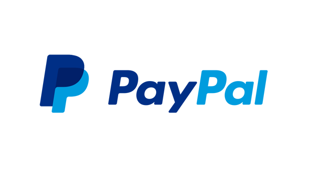

# Declaring {++ Variables++} & {++ Constants++}.

<hr>

## Objective

Learn how to declare variables and constants.

## Variables

Imagine you own a bookstore and you have to manage many books, you remove one book and store another book, now imagine bookstore to be variable, variable can store different values.

Variables can be declared using the keyword {== var==}, besides using the keyword you also need to tell Go which data-type it belongs to. Since Go is a strictly typed language you need to declare the data-type.

The syntax for declaring variable is:

    var variableName type

## Constant

Constants are like locker, once you put a value in it, it cannot be changed, and as usual you need to declare the data type as well.

    const constName type = value

## Structure

Navigate to our code folder

    code/basic/

For our program create a new folder '05_variables_constant'

    code/basic/05_variables_constant

And lets create a file 'variables_constants.go' in it, finally the structure would look like this:

    code/basic/05_variables_constant/variables_constants.go

## Code

???+ example "Variables & Constants"

    ``` go
    1 package main
    2
    3 import "fmt"
    4
    5 func main() {
    6   // Declaring variable "name" of type string
    7   var name string
    8   name = "Octallium"
    9   // Printing out the value of "name"
    10   fmt.Println("The value of 'name' variable is:", name)
    11
    12  // Declaring variable "age" of type int
    13  var age int
    14  age = 9
    15  // Printing out the value of "age"
    16  fmt.Println("The value of 'age' variable is:", age)
    17
    18  // Declaring constant "SECRET_KEY" of type string
    19  const SECRET_KEY string = "abc-123-xyz-098"
    20  // Printing out the value of "SECRET_KEY"
    21  fmt.Println("The value of 'SECRET_KEY' constant is:", SECRET_KEY)
    22
    23  // Values of variables can be changed
    24  name = "Golang Handbook"
    25  fmt.Println("Now the value of 'name' variable is:", name)
    26
    27  age = 13
    28  fmt.Println("Now the value of 'age' variable is:", age)
    29
    30  // SECRET_KEY = "que-472-ert-383" will throw an error as it is a constant
    31 }
    ```

## Run Code

Open your terminal and navigate to our folder

    code/basic/05_variables_constant/

Once in the folder type the following command

    go run variables_constants.go

## Output

???+ success "Output"

        The value of 'name' variable is: Octallium
        The value of 'age' variable is: 9
        The value of 'SECRET_KEY' constant is: abc-123-xyz-098
        Now the value of 'name' variable is: Golang Handbook
        Now the value of 'age' variable is: 13

## Github

Just in case you have some errors with your code, you can check out the code at github repo

[Github Repo](https://github.com/octallium/golang-handbook/tree/master/code)

## Golang Playground

You can also run the code at playground

[Golang Playground](https://play.golang.org/p/WqUCP2CxLwJ)

## Code Review

Lines 7 declares a new variable "name" of type "string" and on line 8 we give it the value of "octallium"

Similarly on line 13 we declare a variable "age" of type int and on line 14 we give it the value of 9, note that there are no double quotes around 9 as it is of type int, strings have to be enclosed within double quotes.

On line 19 we declare a constant of type string and give it a value, on line 30 if we try to change the value, the compiler will throw and error, try uncommenting the line and running the code.

On line 24 & 27 we assign new values to variables and print them out.

## Next

In the next section we will see the short hand method for declaring variables.

## Please Donate ❤️

All the work is provided free of cost and completely open source, but it needs your support and love to keep the activity sustainable.

Any support is genuinely appreciated, you can help by sending a small donation by clicking the below link:

[](https://www.paypal.me/octallium)
